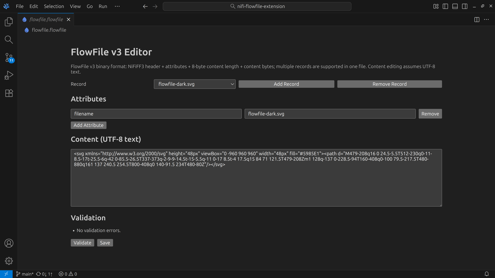
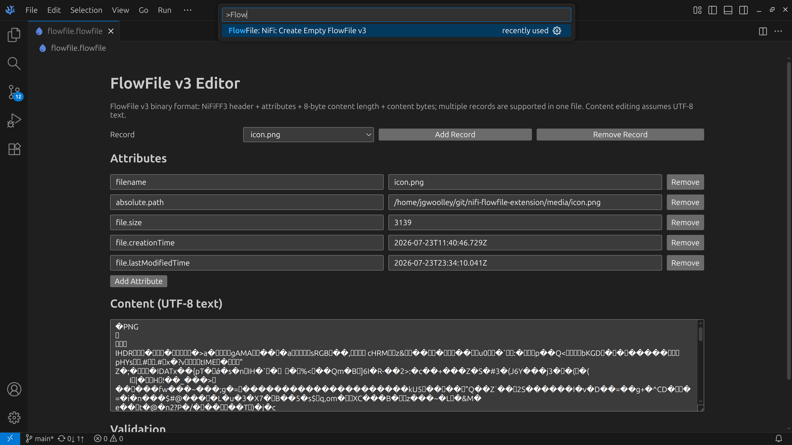

# NiFi FlowFile v3 VS Code Extension



This extension adds a custom editor for FlowFile v3 documents and opens `*.flowfile` and `*.flowfile-v3` files in a structured editor instead of plain text.

It also features a command for creating FlowFile v3



## FlowFile v3 binary format support

The editor now uses a real FlowFile v3 binary stream model based on `NiFiFF3` packaging:

- Each record starts with ASCII magic header: `NiFiFF3`
- Then attribute count (length encoded)
- Then repeated attribute key/value strings (each length encoded)
- Then 8-byte content length (big-endian)
- Then content bytes
- Multiple records can be concatenated in one file and are fully supported in the UI

Length encoding uses:

- 2-byte unsigned length when value is `< 65535`
- `0xFFFF` marker followed by 4-byte unsigned length for larger values

## UI behavior and assumptions

- The custom editor lets you add/remove/select multiple records in one file.
- Each record supports editing attributes and content.
- Content is presented and edited as UTF-8 text in the UI; saving writes UTF-8 bytes back into the FlowFile record.

## Development

```bash
npm install
npm run compile
npm run lint
npm test
npx @vscode/vsce package --no-dependencies
```

## TODO

- Add actual light and dark mode icons